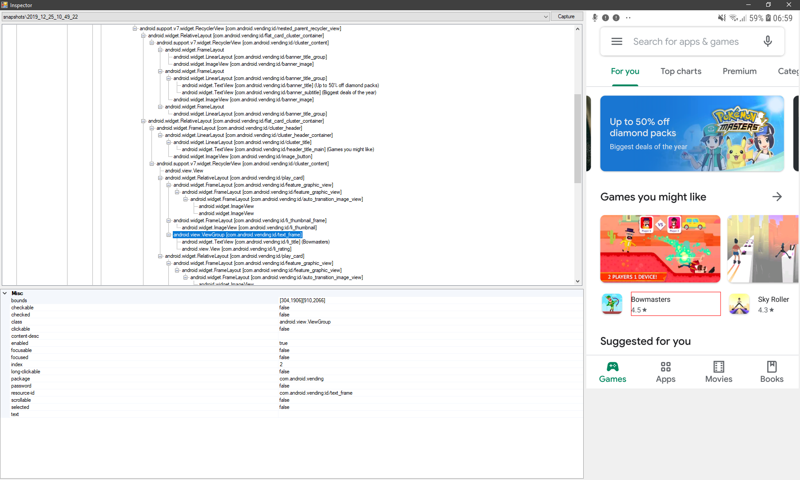

# Android layout inspector

That tool missing from latest Android Studio releases.
Allows you to capture, store, and examine the layout for any application, like old Layout Inspector did.

## Building and running

Visual Studio 2019 or later is required, so app works only on Windows.

App uses TCP connection to ADB via awesome [SharpAdbClient](https://github.com/quamotion/madb)
It does not start ADB on its own, so make sure you have ADB daemon running first.

Code is pretty dirty, but does the job.